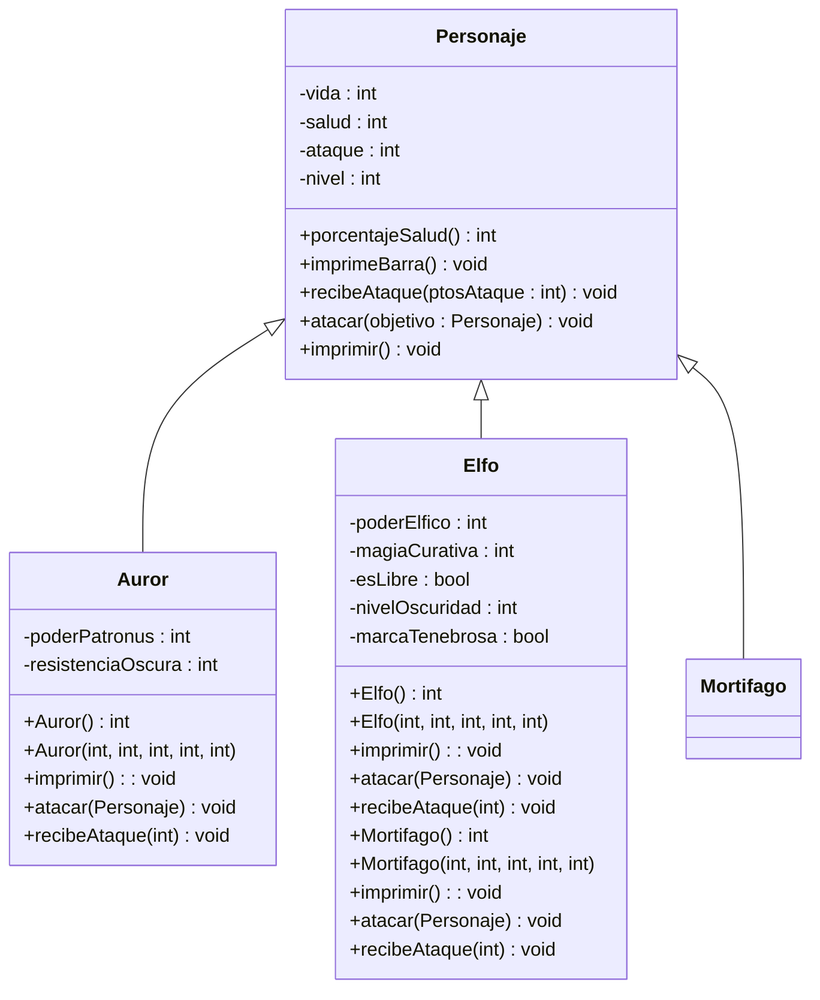

```mermaid
classDiagram
    class Personaje {
        -vida : int
        -salud : int
        -ataque : int
        -nivel : int
        +porcentajeSalud() int
        +imprimeBarra() void
        +recibeAtaque(ptosAtaque : int) void
        +atacar(objetivo : Personaje) void
        +imprimir() void
    }
    Personaje <|-- Auror
    class Auror{
        -poderPatronus : int
        -resistenciaOscura : int
        +Auror() int
        +Auror(int, int, int, int, int)
        +imprimir() : void
        +atacar(Personaje) void
        +recibeAtaque(int) void
    }
    Personaje <|-- Elfo
    class Elfo{
        -poderElfico : int
        -magiaCurativa : int
        -esLibre : bool
        +Elfo() int
        +Elfo(int, int, int, int, int)
        +imprimir() : void
        +atacar(Personaje) void
        +recibeAtaque(int) void
    }
    Personaje <|-- Mortifago
    class Elfo{
        -nivelOscuridad : int
        -marcaTenebrosa : bool
        +Mortifago() int
        +Mortifago(int, int, int, int, int)
        +imprimir() : void
        +atacar(Personaje) void
        +recibeAtaque(int) void
    }

```
